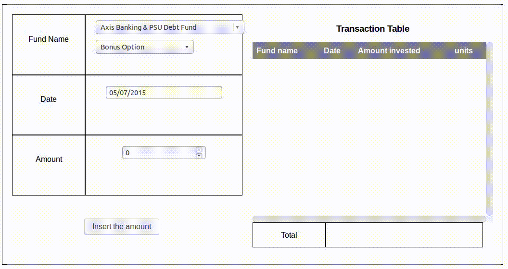

# Investment calculator

This is a simple does calculates the invested amount on particular date in the past to the value in present. The user is allowed to add the amount it had invested, the app calculates the units purchased on the NAV value on that particular time and the app helps the user to determine the current value of its units. The user is allowed to add different funds and the amount is updated accordingly

 