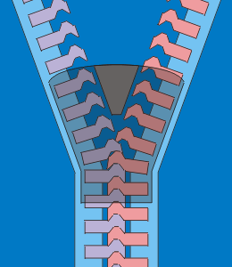

## Problem name
python interview

## Problem Statement
The World is not easy upon us.Whenever we feel we have mastered a topic a situation arises which makes you ask yourself : ``` 'HAVE I  ???' ```

Today was my interview and thus to assess my python skill they asked this: 

```given a sequence : 1,1,1,2,2,3,2,4,3 .. .... n```  
print the sequence for n integers.

But the interviewer sensed the confusion in my face so he gave me a hint ```“the pattern works exactly like a zip”```

EASY ISN'T IT!!!

    “     YOU ARE NOT ALLOWED TO USE 
            FOR,WHILE,DO WHILE,GOTO
        NOT EVEN RECURSION.......!!    ”

        
They saw my accomplishments thus didnt haste for the solution rather given me time to think over .I need you help as I dont want to loose this company.  



## Input format  
a single line containing a number m  
m: the total number of series to be printed (integer)  

## output format
output contains a list of m numbers 

## input
9

## Output :  
```
[1, 1, 1, 2, 2, 3, 2, 4, 3]
```

## my program:
```python
#!/usr/bin/python3
class pattern:
    """docstring for fib"""
    def __init__(self, arg):
        self.arg = arg
        self.fir=1

        self.sec=1
        pass

    def __iter__(self):
        self.count=0
        self.flag=-1
        self.secflag=-1
        return self
        pass

    def __next__(self):
        self.count+=1
        if self.count>self.arg:
            raise StopIteration
            pass
        x=0
        if self.flag==1:
            x=self.fir
            self.fir+=1
        else:
            if self.secflag==1:
                self.sec+=1
                self.secflag=0
            else:
                self.secflag+=1
            x=self.sec
        self.flag*=-1
        return (x)
        pass

def main():
	n=input()
	print(list(pattern(int(n))))
	pass

main()

```